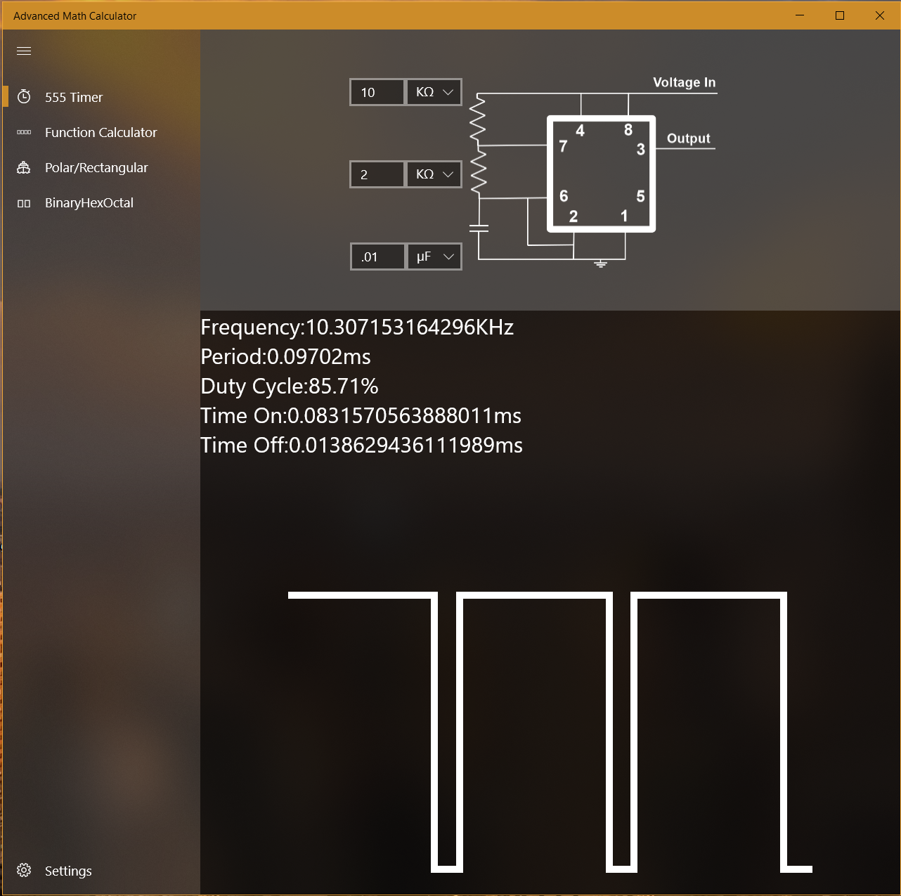
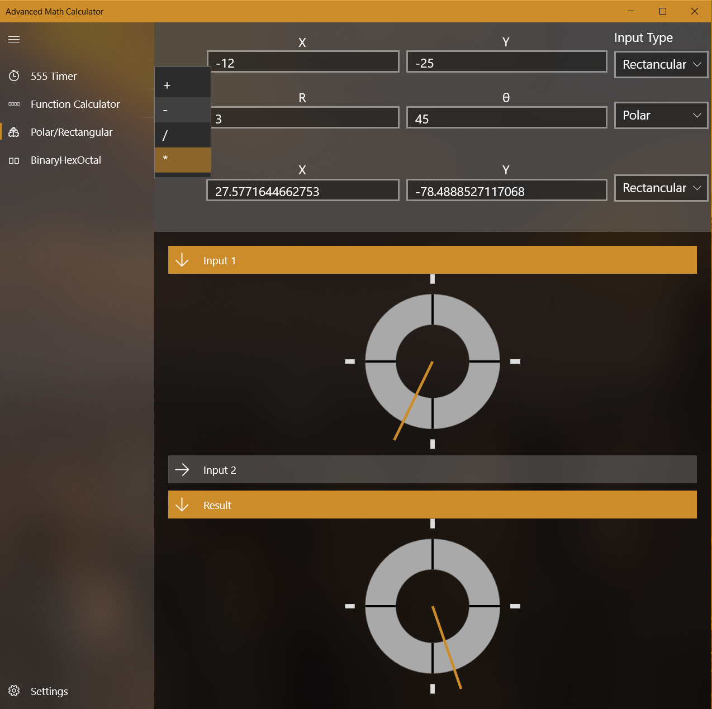

# Engineering-Calculator-UWP
This project is still in alpha. It currently has a a stable multivibrator 555 that shows the output wave, a function calculator given y and x, binary/hex/decimal/octal conversion, and polar and rectangular math with graphs.

<h2> 555 Calculator </h2>

The 555 calculator allows the user to enter three inputs: R1, R2 and C1. The calculator will find the duty cycle, frequency, time off/on and period. It will also show the voltage at the output pin.
   

<h2> Polar Rectangular Calculator</h2>

This calculator takes in two inputs. Either can be polar or rectangular cordinates. It supports four operations: addition, subtraction, division, and multiplication. The output can either be in polar or rectangular. A model of the inputs and outputs can be seen below.
   

